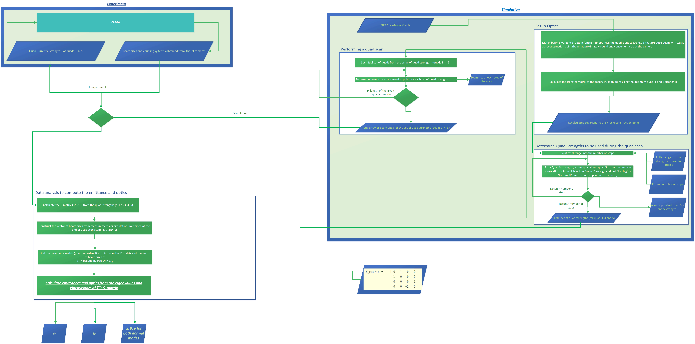

.. Emittance_GUI documentation master file, created by
   sphinx-quickstart on Wed Aug 12 09:55:10 2020.
   You can adapt this file completely to your liking, but it should at least
   contain the root `toctree` directive.

Welcome to Emittance GUI's documentation!
=========================================

In the following, we present the architecture of the app to measure the emittance
via the Machine, Virtual Machine or Simulation.

.. toctree::
   :maxdepth: 2
   :caption: Contents:

   VirtualEmittanceMeasurement.rst
   EmittanceQuadScan.rst
   QuadScan.rst

Indices and tables
==================

* :ref:`genindex`
* :ref:`modindex`
* :ref:`search`
